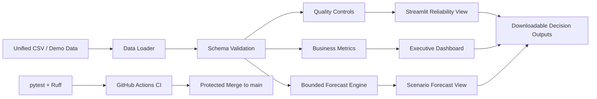

# Architecture

## Design Principle

Separate business logic from presentation so every calculation can be tested independently of Streamlit.

## Layers

### Data Layer

`src/fi_forecast/data.py` loads CSV data, normalizes columns, validates the minimum contract, and returns sorted observation series.

### Quality Layer

`src/fi_forecast/quality.py` executes deterministic controls for schema, record types, percentage ranges, duplicate IDs, source evidence, and date parsing.

### Domain Layer

`src/fi_forecast/metrics.py` calculates percentage-point changes, annualized change, activation rate, progress to target, and latest values.

### Forecast Layer

`src/fi_forecast/forecast.py` fits a bounded logit trend and applies explicit scenario adjustments. No hidden event effect is added without configuration.

### Presentation Layer

`dashboard/app.py` imports the tested domain functions and presents executive metrics, trends, forecasts, controls, and model limitations.

### Delivery Layer

GitHub Actions runs linting and tests on every push or pull request. Docker provides a consistent dashboard runtime.

## Reliability Decisions

- Percentage outputs are bounded by construction.
- Missing or invalid input fields generate explicit failures or quality findings.
- Scenario assumptions are named and visible.
- Forecasting logic is deterministic.
- The system avoids causal language for observational event relationships.
