# Interim Report: Forecasting Financial Inclusion in Ethiopia

## Executive Summary

This interim submission completes data exploration, schema validation, enrichment, and exploratory analysis for Ethiopia's financial inclusion forecasting project. The enriched unified dataset contains **65 records**: 35 observations, 11 events, 16 impact links, and 3 targets.

The central finding is a divergence between rapid digital ecosystem growth and slower growth in unique-adult financial inclusion. Ethiopia's account ownership rate rose from **14% in 2011 to 49% in 2024**, but only increased **3 percentage points between 2021 and 2024**. During the same period, mobile-money adoption, registered accounts, 4G coverage, and P2P transaction volumes expanded rapidly.

This divergence suggests that account registrations and transaction infrastructure are necessary but not sufficient. Duplicate accounts, inactivity, overlap between bank and mobile-money users, limited merchant use cases, affordability, trust, digital literacy, identity barriers, and persistent gender gaps can prevent supply-side expansion from becoming broad and meaningful inclusion.

## Data Enrichment Summary

Eight records were added:

1. 2011 account ownership rate (14%) to complete the Findex access trajectory.
2. 2024 made-or-received digital payment rate (approximately 35%).
3. 2024 use of an account to receive wages (approximately 15%).
4. 128.5 million registered mobile-money accounts by December 2024.
5. A system-wide active mobile-money account share estimate of 15%.
6. The March 28, 2025 launch of National Digital Payments Strategy Phase Two.
7. An impact link from NDPS Phase Two to digital-payment adoption.
8. An impact link from NDPS Phase Two to account ownership.

The event's pillar is blank, while each impact link carries the pillar of the affected indicator. Detailed provenance and modeling cautions are in `data_enrichment_log.md`.

## Key Insight 1: Access Growth Slowed Sharply

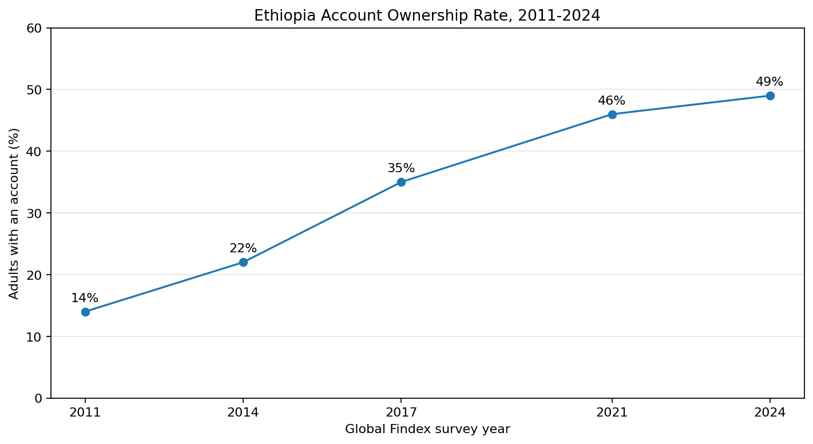

Account ownership increased from 14% in 2011 to 49% in 2024. However, growth between survey rounds slowed from +8 pp, +13 pp, and +11 pp in earlier intervals to only +3 pp between 2021 and 2024.

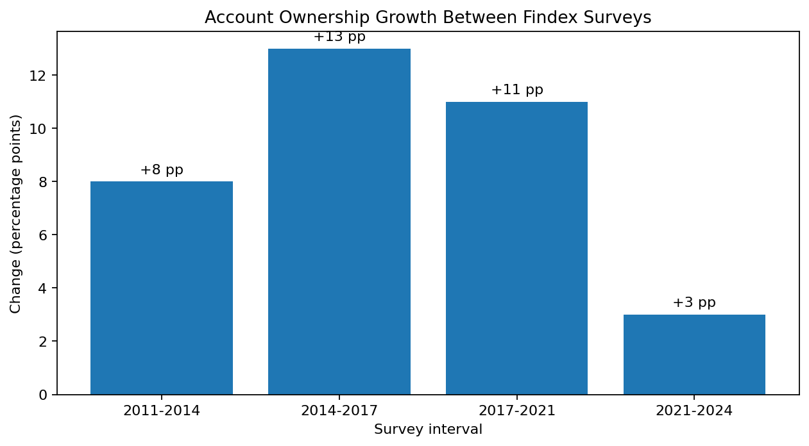

The annualized gain fell to approximately 1 percentage point per year in the latest period. This is the primary forecasting challenge: a long-run upward trajectory now shows a possible slowdown or saturation effect.

## Key Insight 2: Mobile Money Grew Faster Than Overall Ownership

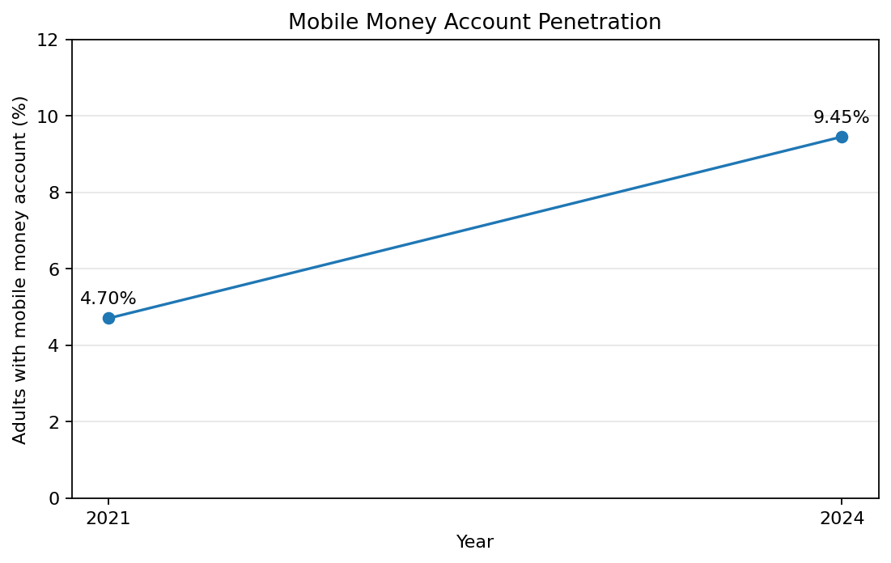

Mobile-money account penetration doubled from 4.7% in 2021 to 9.45% in 2024. This +4.75 pp gain is larger than the +3 pp increase in total account ownership over the same period.

The difference suggests that some mobile-money users already held financial-institution accounts, while supply-side registration totals may include duplicate or inactive accounts. Mobile-money growth therefore does not translate one-for-one into new unique adults entering the formal financial system.

## Key Insight 3: Digital Usage Is Accelerating Rapidly

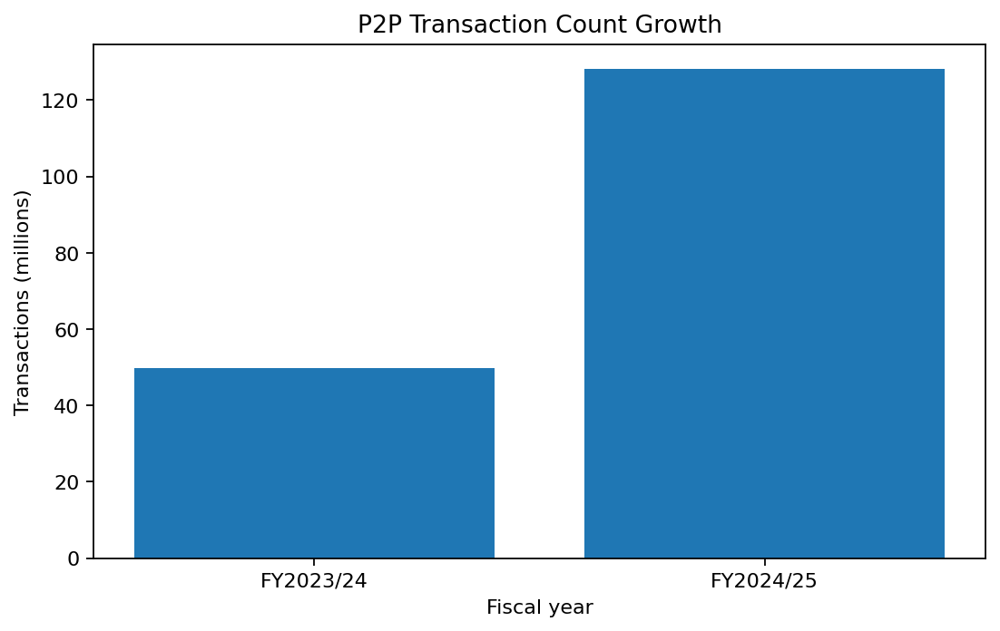

P2P transaction count increased from 49.7 million in FY2023/24 to 128.3 million in FY2024/25, a reported increase of 158%.

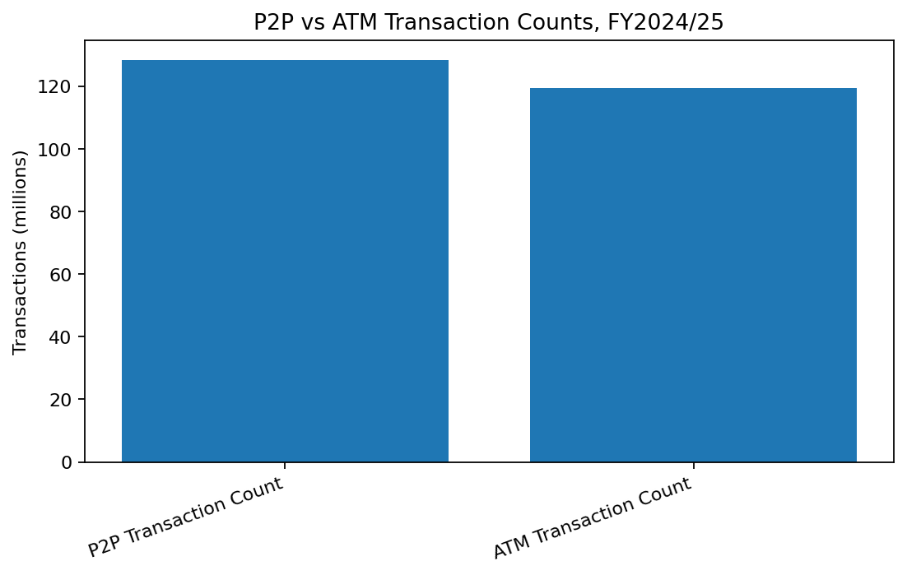

P2P transactions exceeded ATM transactions for the first time: 128.3 million versus 119.3 million. This indicates rapid migration toward digital rails even while survey-measured account ownership grows slowly.

## Key Insight 4: Registration Does Not Equal Activity

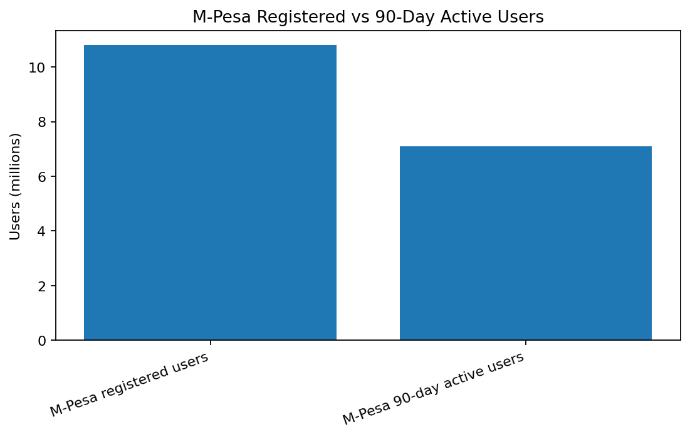

M-Pesa reported 10.8 million registered users and 7.1 million 90-day active users, producing an activity rate of approximately 65.7% and an inactive share of 34.3%.

The NBE strategy material separately reports that only 15% of accounts are active at the system level. These values use different scopes and definitions and should not be directly compared, but both show why registered-account counts can overstate meaningful usage.

## Key Insight 5: Infrastructure Is Necessary but Not Sufficient

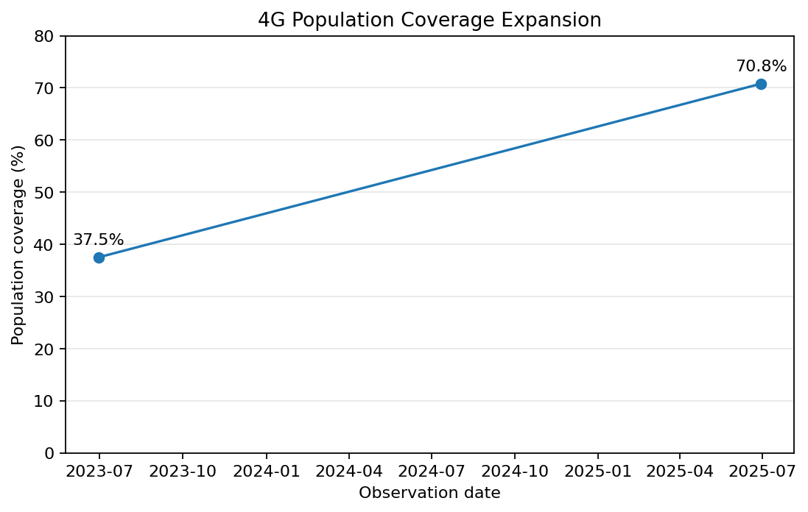

4G population coverage rose from 37.5% to 70.8%, while mobile subscription penetration reached 61.4%. Despite this substantial infrastructure expansion, account ownership growth slowed.

This suggests that future models should treat connectivity as an enabler rather than a complete explanation. Affordability, active agent networks, merchant acceptance, digital ID, trust, consumer protection, and digital literacy are likely required for infrastructure to convert into inclusion.

## Key Insight 6: Gender Gaps Remain Large

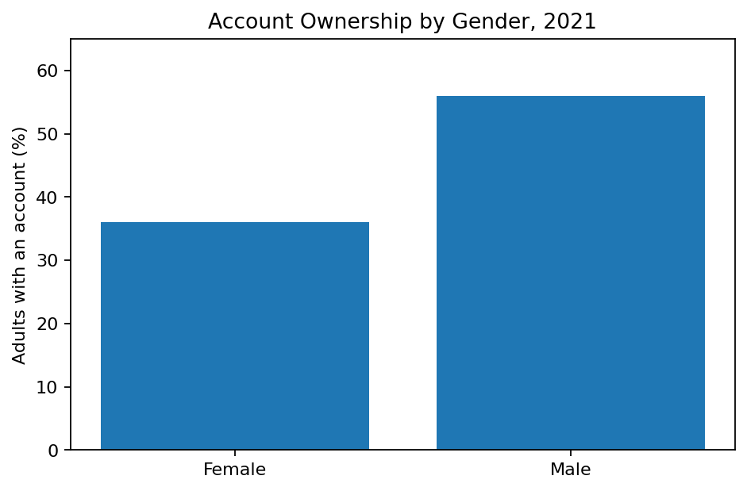

In 2021, male account ownership was 56% compared with 36% for women, a 20 percentage-point gap. The dataset estimates that the gap narrowed only slightly to approximately 18 pp in 2024. Women also held only 14% of mobile-money accounts in the available regulator observation.

The gender gap should be treated as a structural constraint and a separate modeling dimension, not only as a subgroup statistic.

## Event-Indicator Relationships

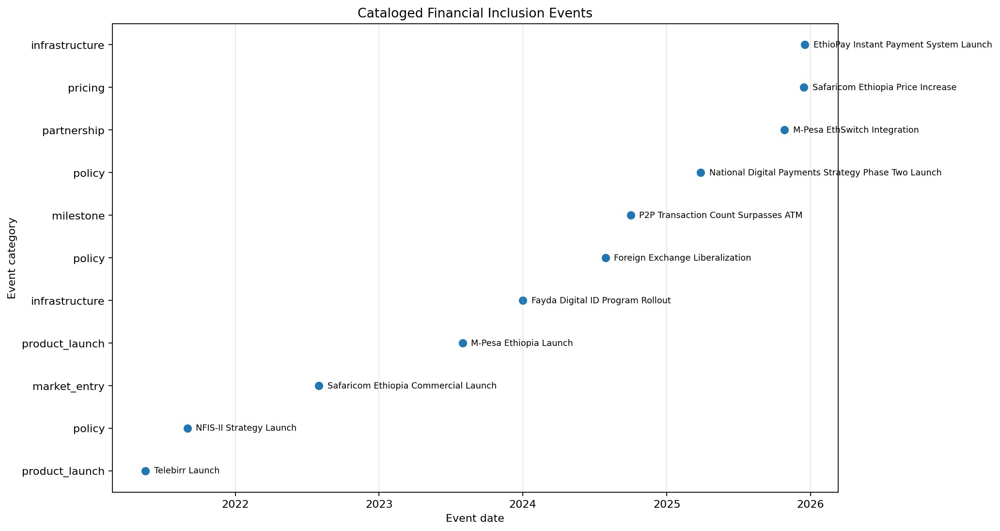

The event catalog includes Telebirr, Safaricom's market entry, M-Pesa, Fayda, foreign-exchange reform, interoperability, EthioPay, pricing changes, and national strategies.

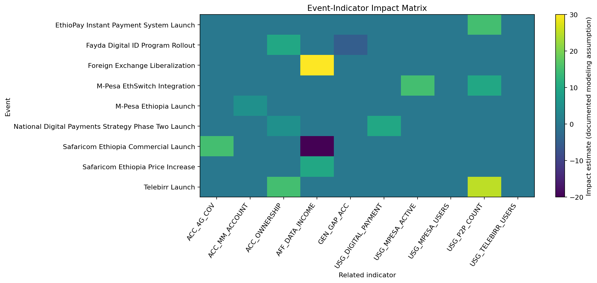

The impact-link matrix makes assumptions explicit. The most important preliminary hypotheses are:

- Telebirr and M-Pesa increase mobile-money access and digital transaction usage.
- Safaricom's entry expands coverage and can improve affordability, while later price increases work in the opposite direction.
- Fayda reduces documentation and KYC barriers, with delayed effects on access and gender inclusion.
- Interoperability and instant-payment infrastructure deepen P2P and active usage.
- NDPS Phase Two enables both access and digital-payment adoption, but its assumed effects require sensitivity testing.

These are not causal findings. Event dates are overlaid on sparse annual or fiscal-year outcomes, so timing alone cannot establish impact.

## Data Quality and Limitations

The dataset has strong source documentation and a high share of high-confidence records, but temporal coverage is weak.

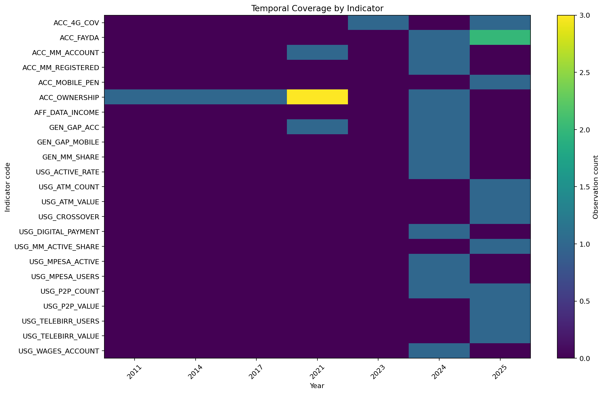

Major limitations are:

- Most indicators have only one observed year.
- Account ownership has only five survey observations over 13 years.
- Operator, regulator, and survey definitions measure different units.
- Registered accounts can include duplicate and inactive accounts.
- Urban/rural, regional, income, and education disaggregation is missing.
- Some 2024 indicators are approximate and marked medium confidence.
- Provider-level and system-wide activity rates are not harmonized.
- Events overlap with macroeconomic shocks and other interventions.
- Correlations are underpowered because very few pairs share three observations.
- Impact estimates are transparent modeling assumptions rather than measured causal effects.

## Implications for Task 3

The event-impact model should remain simple and explainable:

1. Use a bounded baseline trend for percentage outcomes.
2. Apply event effects only through documented impact links.
3. Respect the recorded lag for each event.
4. Test optimistic, base, and pessimistic effect sizes.
5. Keep separate measures for unique adults, registered accounts, active accounts, and transactions.
6. Use wide uncertainty ranges because the historical time series are sparse.

## Conclusion

Ethiopia has experienced a major digital-finance transformation, but rapid growth in accounts, networks, and transaction volumes has not yet produced equally rapid growth in unique-adult account ownership. The forecasting model should therefore focus on the conversion pathway from infrastructure and registration to active, inclusive, and sustained usage.
